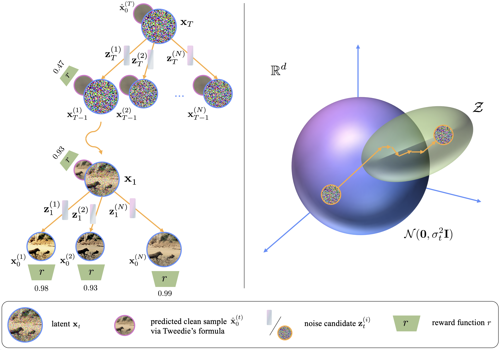

## Test-Time Scaling of Diffusion Models via Noise Trajectory Search<br><sub>Official PyTorch implementation</sub>



**Test-Time Scaling of Diffusion Models via Noise Trajectory Search**<br>
Vignav Ramesh, Morteza Mardani
<br>https://arxiv.org/abs/2506.03164<br>

Abstract: *The iterative and stochastic nature of diffusion models enables test-time scaling, whereby spending additional compute during denoising generates higher-fidelity samples. Increasing the number of denoising steps is the primary scaling axis, but this yields quickly diminishing returns. Instead optimizing the noise trajectory--the sequence of injected noise vectors--is promising, as the specific noise realizations critically affect sample quality; but this is challenging due to a high-dimensional search space, complex noise-outcome interactions, and costly trajectory evaluations. We address this by first casting diffusion as a Markov Decision Process (MDP) with a terminal reward, showing tree-search methods such as Monte Carlo tree search (MCTS) to be meaningful but impractical. To balance performance and efficiency, we then resort to a relaxation of MDP, where we view denoising as a sequence of independent contextual bandits. This allows us to introduce an ϵ-greedy search algorithm that globally explores at extreme timesteps and locally exploits during the intermediate steps where de-mixing occurs. Experiments on EDM and Stable Diffusion reveal state-of-the-art scores for class-conditioned/text-to-image generation, exceeding baselines by up to 164% and matching/exceeding MCTS performance. To our knowledge, this is the first practical method for test-time noise trajectory optimization of arbitrary (non-differentiable) rewards.*

## Requirements

* Linux and Windows are supported, but we recommend Linux for performance and compatibility reasons.
* 1+ high-end NVIDIA GPU for sampling. We have done all testing and development using A100 GPUs.
* Python libraries: See [environment.yml](./environment.yml) for exact library dependencies. You can use the following commands with Miniconda3 to create and activate your Python environment:
  - `conda env create -f environment.yml -n diffusion-tts`
  - `conda activate diffusion-tts`

## Getting started

To generate images using a given model and sampling method, run `main.py` as follows:

```.bash
# Generate image with either EDM/SD and save to file. Example usage:
python main.py --backend sd --scorer brightness --method naive --prompt "A beautiful landscape"

python main.py --backend edm --scorer imagenet --method zero_order
```

```.bash
Arguments:
    --backend   : 'sd' or 'edm' (required)
    --scorer    : 'brightness', 'compressibility', 'clip', or 'imagenet' (required)
    --method    : Sampling method (available: 'naive', 'rejection', 'beam', 'mcts', 'zero_order', 'eps_greedy') (default: 'naive')
    --prompt    : Prompt for SD (default: 'A beautiful landscape')
    --output    : Output filename
    --N, --lambda_, --eps, --K, --B, --S : sampling parameters (see code for defaults)
    --seed      : Random seed (default: 0)
    --device    : Device (default: 'cuda')
```

## License

All material is licensed under the [Creative Commons Attribution-NonCommercial-ShareAlike 4.0 International License](http://creativecommons.org/licenses/by-nc-sa/4.0/).

## Citation

```
@misc{ramesh2025testtimescalingdiffusionmodels,
      title={Test-Time Scaling of Diffusion Models via Noise Trajectory Search}, 
      author={Vignav Ramesh and Morteza Mardani},
      year={2025},
      eprint={2506.03164},
      archivePrefix={arXiv},
      primaryClass={cs.LG},
      url={https://arxiv.org/abs/2506.03164}, 
}
```

## Development

This is a research reference implementation and is treated as a one-time code drop. As such, we do not accept outside code contributions in the form of pull requests.